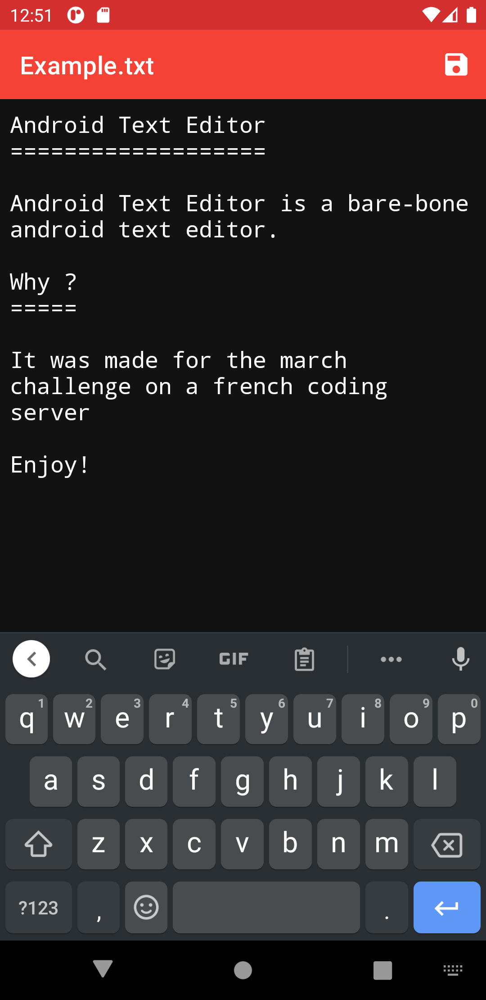
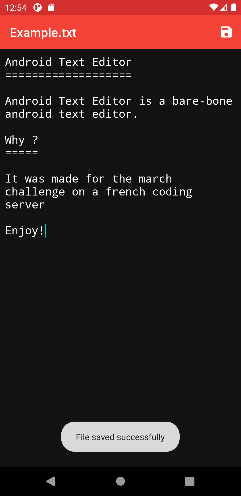

<h1>Android Text Editor</h1>

A bare-bone text editor for Android

## Screenshots

 

## FAQ

**The app asks me for a folder while it should ask me for a file to edit**

It can do that at first start, that's strange. I'll try to fix it but for now please just close the app and open it again, it should then work for the next launches